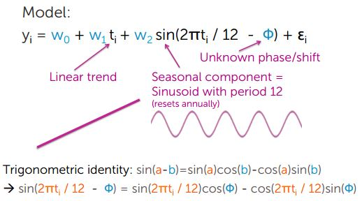
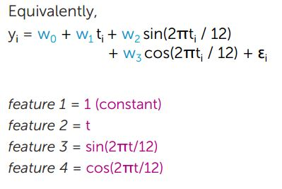
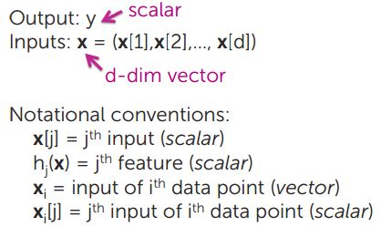
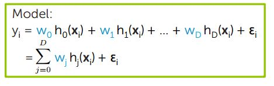

## Multiple Featues of one Input

### Polynomial Regression

### Modeling Seasonality

E.g. x = Month , y = House Prices

- On average, house prices tend to increase with time
- Most houses listed in summer + good houses sell quicky
- Few homes listed in Nov./Dec. + Transactions often leftover inventory or special circumstances

### Other examples of seasonality

- Weather modeling (e.g. temperature, rainfall)
- Flu monitoring
- Demand forecasting (e.g. jacket purchases: Having more stock during winter)
- Motion Capture Data

## Incorporating Multiple Inputs

### Multiple Regression Model

- observations: N
- inputs: d
- features: D

### Computing Cost of Multiple Regression Model

### Using Gradient to minimize Cost

Derivative of RSS

(1) Set Gradient to 0  (gradient = 0 )

(2) Gradient Descent

Here "partial" means partial derivative for jth feature

